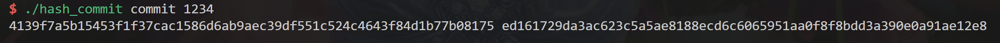
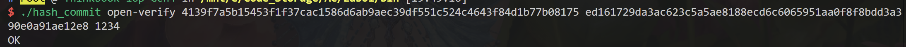
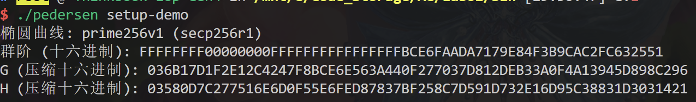
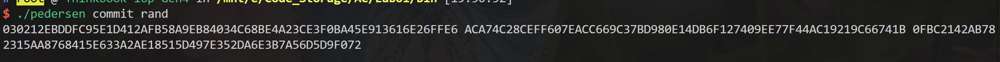
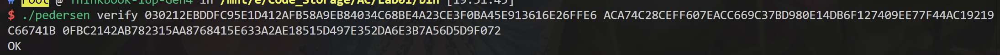
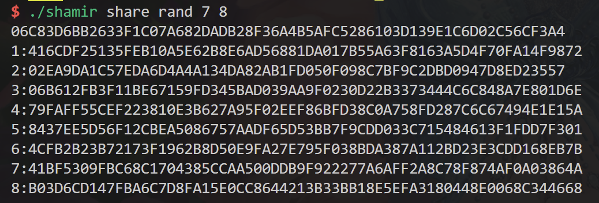
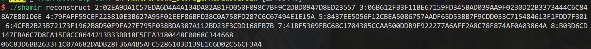
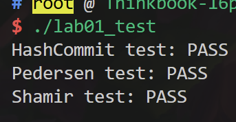

# 高级密码第 01 次实验报告

## 1. 项目简介

### 1.1 系统环境

```sh
Virtualization: wsl
Operating System: Ubuntu 24.04.2 LTS                      
Kernel: Linux 5.15.153.1-microsoft-standard-WSL2
Architecture: x86-64
```

### 1.2 项目依赖

```sh
g++ (Ubuntu 13.3.0-6ubuntu2~24.04) 13.3.0
cmake version 3.28.3
GNU Make 4.3 为 x86_64-pc-linux-gnu 编译
OpenSSL 3.0.13 30 Jan 2024 (Library: OpenSSL 3.0.13 30 Jan 2024)
```

### 1.3 项目编译

```sh
/bin/bash
(mkdir build ; cd build ; cmake .. ; make)
```
可执行文件输出在 `./bin/` 目录下

### 1.4 项目结构

```sh
构建后
.
├── bin
│   ├── hash_commit
│   ├── lab01_test
│   ├── pedersen
│   └── shamir
├── build
├── CMakeLists.txt
├── hash_commit.cpp
├── lab01_test.cpp
├── pedersen.cpp
├── pedersen.h
└── shamir.cpp
```

## 2. 程序运行

### 2.1 *hash_commit*





### 2.2 *pedersen*







### 2.3 *shamir*

 ====



### 2.4 *lab01_test*



## 3. 具体实现

### 3.1 *hash_commit.cpp*

对于字节转 hex，先将每个 8bits 字节强制转换为 int 值后再通过设置 `std::hex`, `std::setw`, `std::setfill` 把对象转换为 hex：

```cpp
std::string to_hex(const std::vector<unsigned char> &buf)
{
    using namespace std; 
    {
        ostringstream oss;
        for (unsigned char byte : buf) {
            oss << hex << setw(2) << setfill('0') << (int)byte;
        }
        return oss.str();
    }
}
```

### 3.2 *pedersen.cpp*

使用 `EC_POINT_mul` 实现点的倍乘，其声明为：

```cpp
int EC_POINT_mul(const EC_GROUP *group, EC_POINT *r, const BIGNUM *n, const EC_POINT *q, const BIGNUM *m, BN_CTX *ctx)

Computes r = generator * n + q * m

参数:
group – underlying EC_GROUP object // 群参数
r – EC_POINT object for the result // 存储结果
n – BIGNUM with the multiplier for the group generator (optional) // 省略, nullptr
q – EC_POINT object with the first factor of the second summand // 需要进行倍点运算的点
m – BIGNUM with the second factor of the second summand // 标量
ctx – BN_CTX object (optional)

返回:
1 on success and 0 if an error occurred
```

计算 $C = m*G + r*H$ :

```cpp
EC_POINT *pedersen_commit(const EC_GROUP *group, const BIGNUM *m, const BIGNUM *r,
                          const EC_POINT *G, const EC_POINT *H, BN_CTX *ctx)
{
    auto mG = EC_POINT_new(group);
    auto rH = EC_POINT_new(group);
    EC_POINT_mul(group, mG, nullptr, G, m, ctx);
    EC_POINT_mul(group, rH, nullptr, H, r, ctx);
    auto C = EC_POINT_new(group);
    EC_POINT_add(group, C, mG, rH, ctx);
    EC_POINT_free(mG);
    EC_POINT_free(rH);  

    return C;
}
```

验证承诺，根据 $m$ , $r$, $H$ 计算 $C' = mG + rH$:

```cpp
bool pedersen_verify(const EC_GROUP *group, const EC_POINT *C, const BIGNUM *m, const BIGNUM *r,
                     const EC_POINT *G, const EC_POINT *H, BN_CTX *ctx)
{
    auto *mG = EC_POINT_new(group);
    auto *rH = EC_POINT_new(group);
    EC_POINT_mul(group, mG, nullptr, G, m, ctx);  
    EC_POINT_mul(group, rH, nullptr, H, r, ctx);  
    EC_POINT *C_ = EC_POINT_new(group);
    EC_POINT_add(group, C_, mG, rH, ctx);  // C' = mG + rH
    int cmp_result = EC_POINT_cmp(group, C, C_, ctx);  
    if (cmp_result < 0) {
        std::cout << "At" << __LINE__;
        throw std::runtime_error("EC_POINT_cmp failed");
    }

    EC_POINT_free(mG);
    EC_POINT_free(rH);
    EC_POINT_free(C_);
    return cmp_result == 0;
}
```

### 3.3  *shamir.cpp*

对于根据 *coeffients* 计算 *Poly* 的值，这里通过 **AI** 了解到可以使用 *霍纳法则* 而不用通过遍历系数表计算每一个子项再相加的方式进行计算：

```cpp
BIGNUM *eval_poly(const std::vector<BIGNUM *> &coeffs, const BIGNUM *x, const BIGNUM *mod)
{
    // std:: cout << "Call " << __FUNCTION__ << "\n";
    auto res = BN_new(); // init
    BN_zero(res);

    auto len = coeffs.size();
    auto CTX = BN_CTX_new();

    // 霍纳法则
    for (int i = len - 1; i >= 0; --i) { // 高位到低位
        BN_mod_mul(res, res, x, mod, CTX); // res * x
        BN_mod_add(res, res, coeffs[i], mod, CTX); // res + coeffs [i]
    }

    BN_CTX_free(CTX);
    return res;
}
```

[拉格朗日插值](https://klizz.top/zk/r1cs.html#%E5%AE%9A%E4%B9%89) 恢复多项式：

```cpp
BIGNUM *lagrange_reconstruct_at_zero(const std::vector<std::pair<BIGNUM *, BIGNUM *>> &points, const BIGNUM *mod)
{
    auto len = points.size();

    BIGNUM *result = BN_new();
    BN_zero(result);
    BN_CTX *ctx = BN_CTX_new();

    auto ZERO = BN_new();
    BN_zero(ZERO);

    for (int i = 0; i < len; ++i) {
        BIGNUM *li = BN_new();
        BN_one(li); // 初始化为 1

        // x - x_j / x_i - x_j
        // len 个点计算 len - 1 个分式
        for (int j = 0; j < len; ++j) { // len
            if (j == i) continue; // len - 1

            // -x_j mod mod
            BIGNUM *_xj = BN_new();
            BN_mod_sub(_xj, ZERO, points[j].first, mod, ctx);

            // xi - xj mod mod
            BIGNUM *xi_m_xj = BN_new();
            BN_mod_sub(xi_m_xj, points[i].first, points[j].first, mod, ctx);

            //  1 / (xi - xj) mod mod
            BIGNUM *_xi_m_xj = modinv(xi_m_xj, mod);

            // -xj / xi-xj mod mod
            BIGNUM *final = BN_new();
            BN_mod_mul(final, _xj, _xi_m_xj, mod, ctx);

            // li *= final mod mod
            BN_mod_mul(li, li, final, mod, ctx);

            BN_free(_xj);
            BN_free(xi_m_xj);
            BN_free(_xi_m_xj);
            BN_free(final);
        }

        // yi * li mod mod
        BIGNUM *contrib = BN_new();
        BN_mod_mul(contrib, points[i].second, li, mod, ctx);

        // result += contrib mod mod
        BN_mod_add(result, result, contrib, mod, ctx);

        BN_free(li);
        BN_free(contrib);
    }
    
    return result;
    return nullptr; // 临时返回，学生需要替换
}
```

实现秘密恢复，即从 $t$ 个点恢复多项式 $f(x) = secret + a_1x + a_2x^2 + ... + a_{t-1}x^{t-1}$ 并计算出 $secret=fx(0)$，而在分法秘密时既从 $f(x)$ 计算出 $n$ 个点：

```cpp
std::vector<std::pair<int, BIGNUM *>> generate_shares(BIGNUM *prime, const std::vector<BIGNUM *> &coeffs, int n)
{
    // std:: cout << "Call " << __FUNCTION__ << "\n";
    std::vector<std::pair<int, BIGNUM *>> shares;

    auto len = coeffs.size();
    try {

        for (int i = 1; i <= n; ++i) {
            auto x = BN_new();
            BN_set_word(x, i);

            auto y = eval_poly(coeffs, x, prime);
            shares.push_back({i, y});

            BN_free(x); 
        }
    } catch (const std::exception &e) {
        std::cerr << "Error: " << e.what() << "\n";
    }

    return shares;

    return {}; // 临时返回，学生需要替换
}
```
