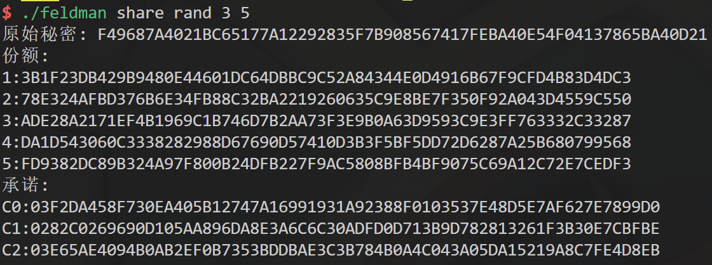
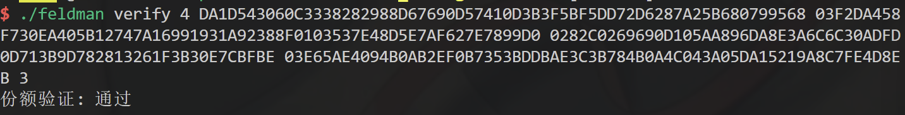
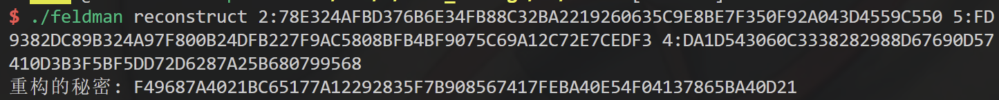
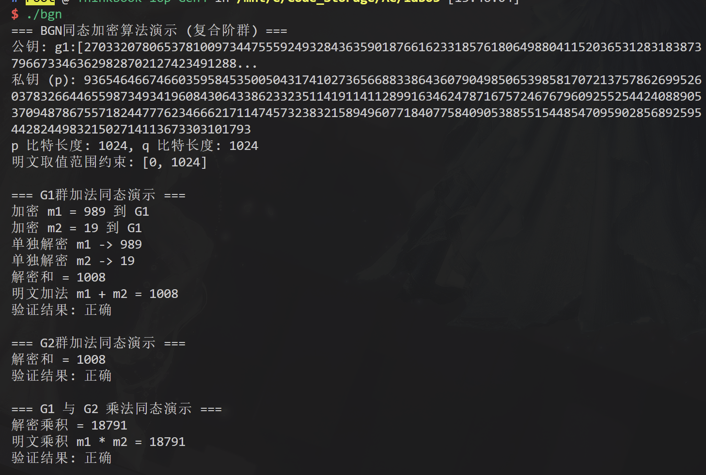

# 高级密码第03次实验报告

## 实验环境

### 系统环境
```sh
Virtualization: wsl
Operating System: Ubuntu 24.04.2 LTS                      
Kernel: Linux 5.15.153.1-microsoft-standard-WSL2
Architecture: x86-64
```

### 环境依赖
```sh
g++ (Ubuntu 13.3.0-6ubuntu2~24.04) 13.3.0
cmake version 3.28.3
GNU Make 4.3 为 x86_64-pc-linux-gnu 编译
OpenSSL 3.0.13 30 Jan 2024 (Library: OpenSSL 3.0.13 30 Jan 2024)
PBC-1.0.0
```

## 1. Feldman

### 程序编译

```sh
g++ --std=c++17 -o feldman feldman.cpp -lssl -lcrypto
```

### 程序运行

1. 生成密码和份额


2. 验证份额


3. 恢复秘密


### 具体实现

1. 多项式秘密生成与恢复

+ 复用了之前Shamir中的`eval_poly`、`generate_secret_and_coeffs`、`reconstruct_secret`函数。（utils.hpp）

2. 份额承诺生成与验证，使用的是椭圆曲线离散对数问题系数进行隐藏

```cpp
// 份额生成
// feldman.cpp::generate_feldman_shares_and_commitments
    // 生成承诺
    for (size_t j = 0; j < coeffs.size(); j++)
    {
        EC_POINT *Cj = EC_POINT_new(group);
        EC_POINT_mul(group, Cj, nullptr, generator, coeffs[j], nullptr); // Cj = aj * G
        commitments.push_back(Cj);
    }
```
既对于多项式 $f(x) = a_0 + a_1 x + a_2 x^2 + ... + a_{t-1} x^{t-1}$ ，生成承诺 $C_j = a_j \cdot G$ 。

```cpp
// 份额验证
// feldman.cpp::verify_share

// ....
    // 1. left = y * G
    EC_POINT *left = EC_POINT_new(group);
    EC_POINT_mul(group, left, nullptr, generator, y, nullptr); 
    // cout << "Call " << __LINE__ << "\n";

    // 2. right = sum( Cj * x^j )
    EC_POINT *right = EC_POINT_new(group);
    EC_POINT_set_to_infinity(group, right); // 初始化零元

    BIGNUM *x_bn = BN_new();
    BN_set_word(x_bn, x); // x 转换为 BIGNUM

    BIGNUM *x_pow = BN_new();
    BN_one(x_pow); // x^0 = 1

    BN_CTX *ctx = BN_CTX_new();

    for (size_t j = 0; j < commitments.size(); j++)
    {
        // cout << "Call " << __LINE__ << "\n";
        EC_POINT *term = EC_POINT_new(group);
        EC_POINT_mul(group, term, nullptr, commitments[j], x_pow, ctx); // term = Cj * x^j
        EC_POINT_add(group, right, right, term, ctx);                   // right += term

        // 更新 x_pow = x^(j+1)
        BN_mod_mul(x_pow, x_pow, x_bn, prime, ctx);

        EC_POINT_free(term);
    }

    // 3. left == right
    bool valid = (EC_POINT_cmp(group, left, right, ctx) == 0);

// .....
```
既计算 $y \cdot G == \sum C_j \cdot x^j$ , $\because y = f(x) = \sum a_j x^j$ , $\therefore y \cdot G = \sum (a_j \cdot G) \cdot x^j = \sum C_j \cdot x^j$ 。

## 2. 分布式Elgamal

### 程序编译

```sh
g++ ./elgamal_distributed.cpp -o elgamal_distributed -lssl -lcrypto
```

### 程序运行

```sh
$ ./elgamal_distributed 
=== ElGamal加密算法演示 ===
生成安全1024位密钥参数...
公钥 (1024位素数 p): p: CB68076DA1A034CBB3861ED54B760766697AA11AC355319DCB849250BBCEEB1256BE6B16146F735A4804E32A62AE645C6C7F38415613E6FCCCFD7A02114B9FCD221FB040336B7350D0FA50832E034CABCEA009FE80B2F2660E8DB5C6053D3AD56E415D7D97207F7E5F7F5C982543F73D5DE31177E74DB2D294AF61EBB959CF7F
g: 248E73F169E02F1A23C88B3D37C84B4C473ECC0308FF0DE01658E90BCA6B99EC33595D4EF0086ABC507E9B672F4F8F7DB2486B3002FC8534FF7E14D15E471C3C743334DF363F179C5A925E479D0FFEB0E2B9731EB1CED644A7E974362B21F82594405AEE27F0DC0513014BAC8E9E68F4CC16A60C932E33F904B716DF6480D4F6
y: 3BA2330065349FB18411ADE06033D17BC9340976B4E92D73056057B77B5F824023659277A866628893C77EF8E9624BB48CBEE641738F427C5CD1694C6E420032197A891422AB1E364B3A151544EDFADB6FF3F021A5AB44051705EB626D21B029E064B2BFAA821423950E88AEC8E5341ABF1F03F1904B7C611E42C2B335C9088F
私钥 (x值 - 为安全起见部分显示): x: 63255931A9367B3DEF0121367D7946BA4C1CC6D2CFA1625...[为安全起见已截断]

=== 加密解密演示 ===
原始消息: 12453
密文: (35D13F7502E86FB35305F7B80119838BBE68D9822778C708827EB07C3A7FE61A7EFD746C38E4389DC5A680F2379BF686EAE76ECEB7DA7852F844346C2688041508D0360020C2C919BE5F5CA8C0A6EEC768A81FE4E06B80C56D799D37CFD3981FB5DEF481802D0C139DDF78249791CAE9AA89BF4447A83178E744C57F04C221B9, C1C5718D1DC1886273FE89DD4626F2D114ED7D2179E76E7BEACEA1152DC8BDCCC6FADEB709194BF7BCB82AA2D41B18E186A72836927CAD198F408420B2FA20DC5CCA0C65FDB39CBFB8281A7F75F8261FD39C93B3CEDA61CE7C7315C144243D3E9CF26442A4293D922BAAEAA6B8F0BC73F3648125892B4A9AA9E6E59F764F3551)
解密结果: 12453
加解密验证: 成功

=== ElGamal分布式解密演示 ===
分布式解密演示消息: 31836
分布式解密密文: (3606FCAEE1894B3C5A0B924EB36B7D17704F9B30DA2C1A9B661FA3B654C1CADBA71BDE8D59E375F7A7171FE11195E916EEBA46AD3601E5117BA70C3D80FD58B4F4B3FC341F8B85E1098ADE6327EA5D6AD7CAF8023BBDDC46DAA644985129B500CBEF3D94B6CFF43E98AF164B0D29BE229C2171067F5913CC457002E2A10C66A9, 464AB7DF5AB617BB0AC0107E028632F8B59583FD40F38F6F3C9B99FA552EBC3408981CF9AE412985748F428457E1D92D1BE02E6EC6B1EB83E941D98308FD1BEE56A14F4D1A607B82609B82935637828D4A9F8C8A537B687B4C6F96C71D3C663F92AA4C20A556BE3944E5D301DAC13D3C98BDE9DEB9CA3F45189CBB795C84696F)
生成了 6 个份额，阈值为 4
选择份额 5: 63485817177423688658112890170229136859595480734882959409225106189562132270319043119959578897174226511518055244691964243860058776904038211846686994099890096125526158746182072757643570432088327740173168790650559155738086177335543120933735689977786847482831426060650726349880793985553833851700345268958618638935
选择份额 2: 55501339388555287402679481140668203723440304179336097574820494957838163325436609556979622939818294345716765489101600685757075634291659076491111667742318311220848853045025436518596252619488861217534949049727318422169994637381198698142702036400603970779983089352592351259724757605983775505482116708805939837883
选择份额 4: 8616024132734607856980638967403674796991512652307382424989992295591134283650681119186148012266878341859533931319413351011460789287162039665475870341711580678294296383132382228025601879970545708554096363663444222299116632434910427167933414021240804510309396178867863153799424229213925420284499644484498498534
选择份额 1: 113344635892443598734942432661974604024431951511314120766076422427343406753435819616474926221191854073893271446730589129516994234130220237494204976980796706440062370219104149112524218614301615834260210424638502426776506359247402275562922506138259792704642676755945066008617155975592249863051219289525658235455
分布式解密结果: 31836
分布式解密验证: 成功

验证不同份额组合的解密结果...
使用不同份额组合的解密结果: 31836
不同份额组合解密验证: 成功
```

### 具体实现

1. Elgamal部分复用了第一次实验课的代码。

2. 份额的产生和恢复也一样复用了Shamir中的代码。

## 3. BGN

### 程序编译

```sh
g++ ./bgn.cpp -o bgn --std=c++17 -lpbc -lgmp -lssl -lcrypto
```

### 程序运行



### 具体实现

1. 加密
    + 对于生成 $Z_r$ 中的元素操作，使用 [element_init_Zr](https://crypto.stanford.edu/pbc/manual/ch04s01.html#:~:text=void-,element_init_Zr,-(element_t%20e))
    + 对于 `element_t` 到 `mpz_t` 的转换，使用 [element_to_mpz](https://crypto.stanford.edu/pbc/manual/ch04s03.html#:~:text=void-,element_to_mpz,-(mpz_t%20z))
  
    ```cpp
    CipherG1 encrypt_g1(long long m) {
        // 1. 规约m
        auto norm_m = NormalizePlaintext(m);
    
        // 2. Gen r in Zn
        element_t r;
        // 规约到Zn
        element_init_Zr(r, mutable_pairing());
        element_random(r); // 随机采样r
    
        // 3. caculate h1^r
        element_t h1_r;
        element_init_G1(h1_r, mutable_pairing());
        mpz_t r_mpz;
        mpz_init(r_mpz);
        element_to_mpz(r_mpz, r);
        element_pow_mpz(h1_r, h1_, r_mpz);
    
        // 3. norm_m 转 mpz
        mpz_t m_mpz;
        mpz_init_set_ui(m_mpz, norm_m);
    
        // 4. 求 g1^m
        element_t g1_m;
        element_init_G1(g1_m, mutable_pairing());
        element_pow_mpz(g1_m, g1_, m_mpz);
    
        // 5. caculate g1^m * h1^r
        element_t ciphertext;
        element_init_G1(ciphertext, mutable_pairing());
        element_mul(ciphertext, g1_m, h1_r);
    
        // free
        element_clear(r);
        element_clear(h1_r);
        mpz_clear(r_mpz);
        mpz_clear(m_mpz);
        element_clear(g1_m);    
    
        // return
        CipherG1 ct(mutable_pairing());
        element_set(ct.value, ciphertext);
        element_clear(ciphertext);
    
        return ct;
    }
    ```

    2. 解密

    ```cpp
    long long decrypt_g1(const CipherG1& ct) {
        // init temp_g1
        element_t temp_g1;
    
        // set Ciphertext.value 2 temp_g1
        element_init_G1(temp_g1, mutable_pairing());
        element_set(temp_g1, Mutable(ct.value));
    
        // calculate ct^p
        element_t g_p_m;
        element_init_G1(g_p_m, mutable_pairing());
        element_pow_mpz(g_p_m, temp_g1, p_);
    
        // call BabyStepGiantStep
        long long m = BabyStepGiantStep(g_p_m, g1_p_, kMaxPlaintextValue);
        
        // free
        element_clear(temp_g1);
        element_clear(g_p_m);
    
        return m;
    }
    ```

    3. 同态加

    ```cpp
    CipherG1 add_g1(const CipherG1& ct1, const CipherG1& ct2) const {
        CipherG1 result(mutable_pairing());
        element_mul(result.value, Mutable(ct1.value), Mutable(ct2.value));
        return result;
    }
    ```

    4. 同态乘与同态乘解密

        + 对于配对，发现使用[element_pairing](https://crypto.stanford.edu/pbc/manual/ch03s02.html#:~:text=void-,element_pairing,-(element_t%20out))也可以
        ```cpp
        void multiply_g1_g2(const CipherG1& ct1, const CipherG2& ct2, element_t result) const {
            element_t temp_gt;
            element_init_GT(temp_gt, mutable_pairing());
            // pairing_apply(temp_gt, Mutable(ct1.value), Mutable(ct2.value), mutable_pairing());
            element_pairing(temp_gt, Mutable(ct1.value), Mutable(ct2.value));
            element_set(result, temp_gt);
            element_clear(temp_gt);
            return;
        }
        ```
        
        + 同态乘解密
        
        ```cpp
        long long decrypt_product(element_t value) {
            element_t temp_gt;
            element_init_GT(temp_gt, mutable_pairing());
            element_pow_mpz(temp_gt, value, p_);
            long long m = BabyStepGiantStep(temp_gt, gt_generator_p_, kDiscreteLogUpperBound);
            element_clear(temp_gt);
            return m;
        }
        ```