# 高级密码第05次实验报告

## 系统环境

```sh
 Virtualization: wsl
 Operating System: Ubuntu 24.04.2 LTS                      
Kernel: Linux 5.15.153.1-microsoft-standard-WSL2
 Architecture: x86-64
```

## IBE和ABE

### 项目编译

```bash
mkdir -p ./build &&
cd ./build &&
cmake .. &&
make 
```

### BF-IBE

#### 运行结果

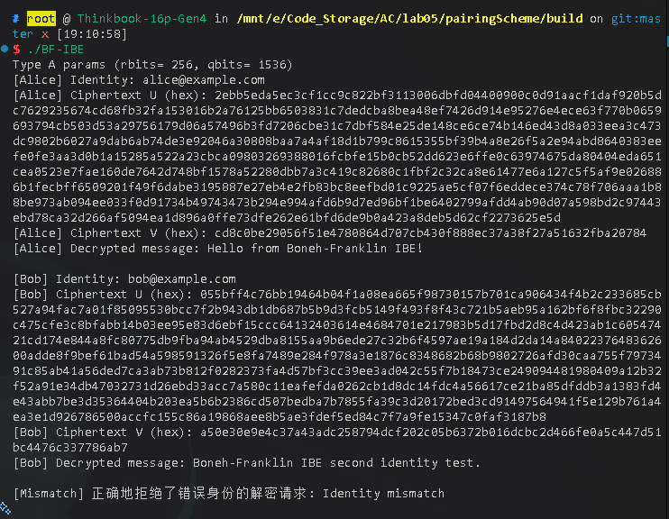

### BF-IBE2

#### 运行结果

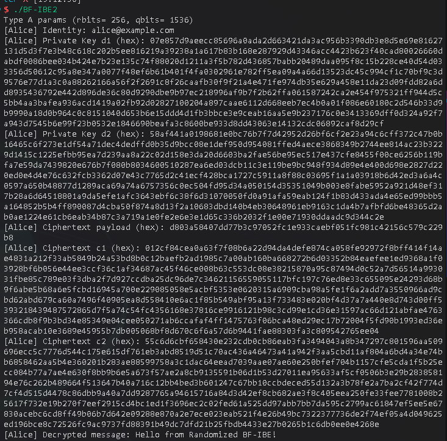

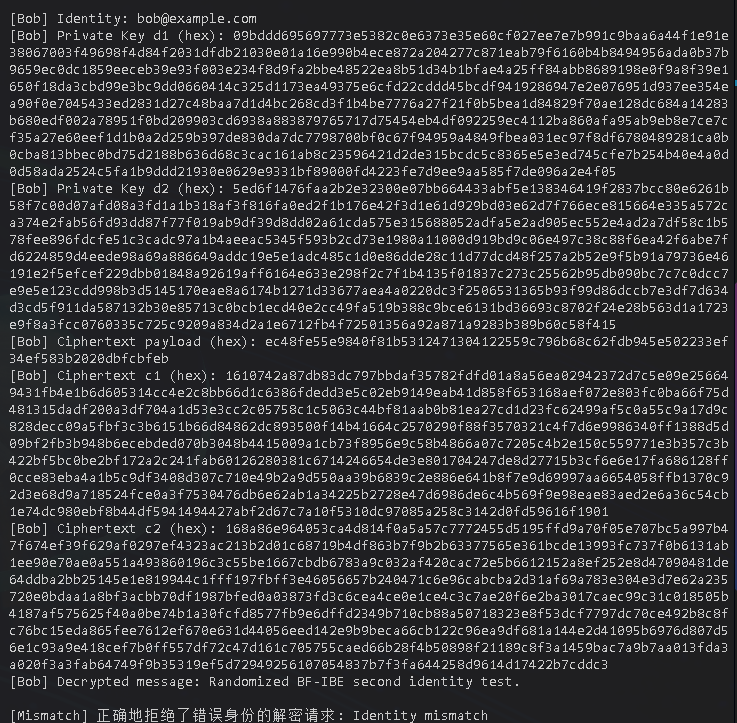

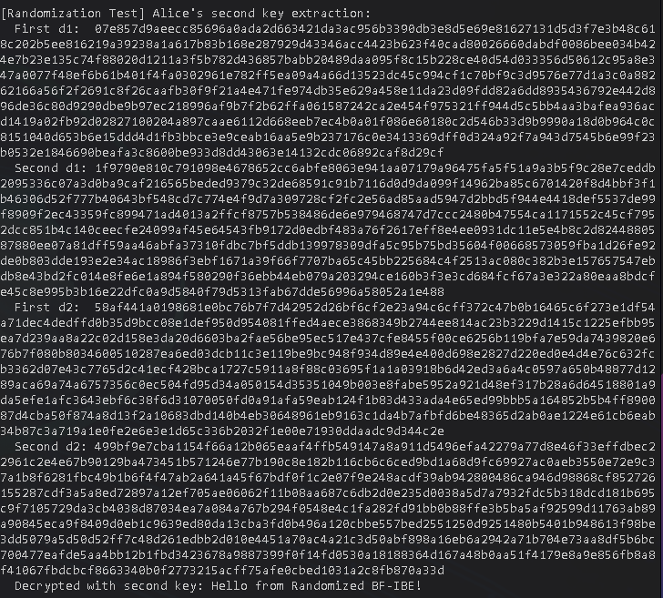

### Fuzzy IBE 

#### 运行结果

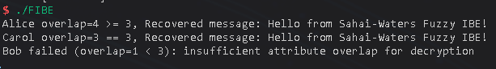

### CP-ABE 

#### 运行结果

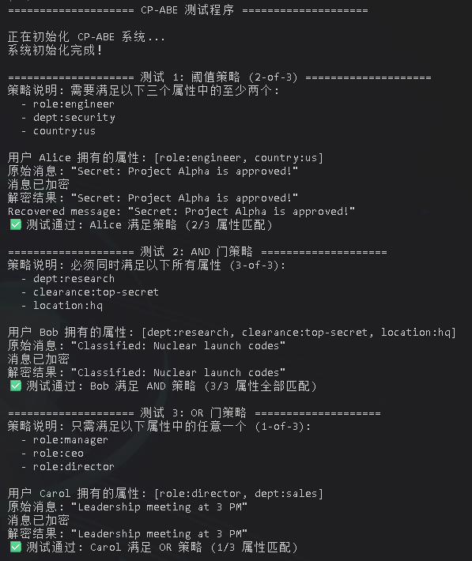

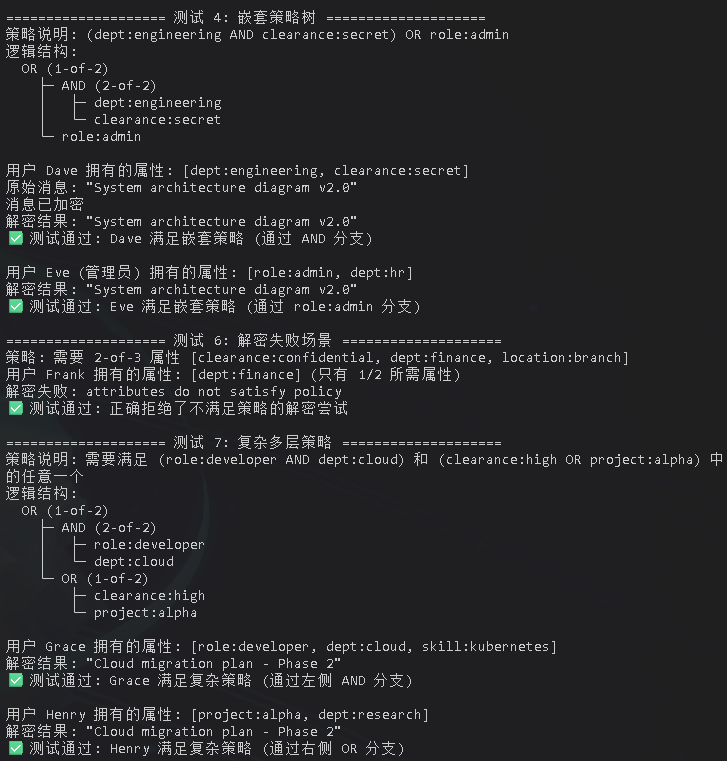

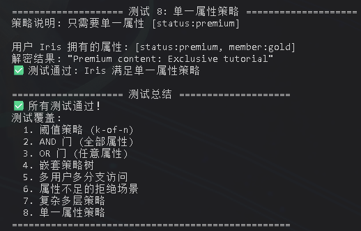

### KP-ABE

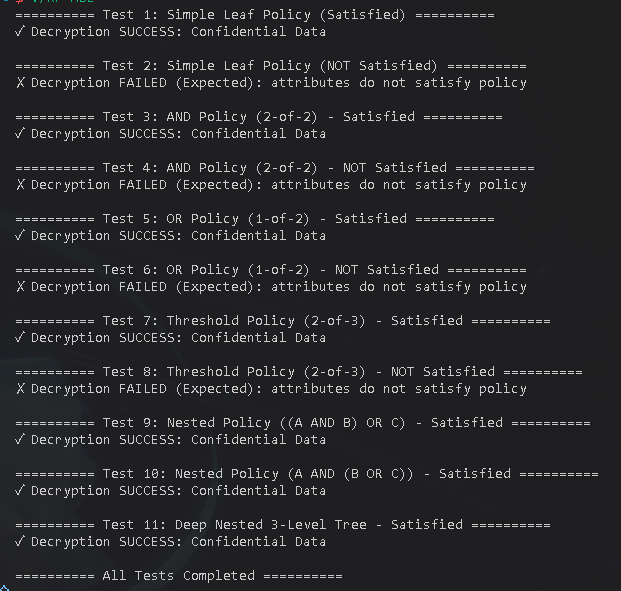

### 具体实现

任务1、2、3、5都是根据提示实现就好，在实现任务4时主要在于编写`decryptNode`函数时，对于节点的遍历有一个for循环的起始index写错了，导致调试了半天才发现。

## 盲签名

### RSA盲签名

#### 主程序代码

```cpp
int main() {
    using namespace std;
    RsaBlindSign signer;
    signer.keygen(2048);

    const string message = "Blind signatures are cool";
    cout << "Message: " << message << endl;
    auto br = signer.blind(message);
    cout << "===Blinding===" << endl;
    cout << "Blinded Message: " << br.blinded_msg << endl;
    cout << "Nonce: " << br.nonce << endl;
    auto signed__ = signer.sign(br.blinded_msg);
    cout << "===Signing===" << endl;
    cout << "Signed Blinded Message: " << signed__ << endl;
    auto unblid = signer.unblind(br.nonce, signed__);
    cout << "===Unblinding===" << endl;
    cout << "Unblinded Signature: " << unblid << endl;
    cout << "===Verifying===" << endl;
    if (signer.verify(message, unblid)) {
        cout << "Signature Verified!" << endl;
    } else {
        cout << "Signature Verification Failed!" << endl;
    }
}
```

#### 程序编译

```bash
g++ rsa_blind_sign.cpp -o rsa_blind_sign -lssl -lcrypto
```

#### 运行结果

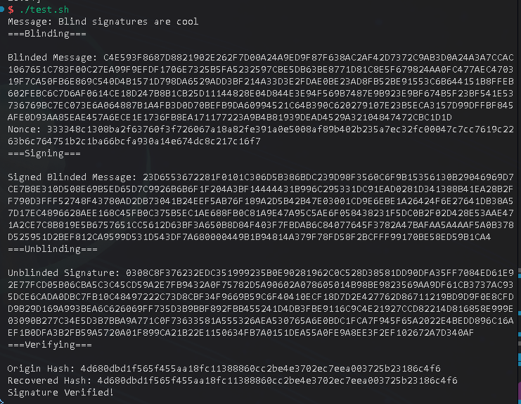

#### 具体实现

1. $Setup$: 签名者选择两个大素数 $p$ 和 $q$，计算 $n = p \cdot q$，计算 $ed = 1 \; mod \; \phi(n)$，其中 $\phi(n) = (p-1)(q-1)$。公钥为 $(e, n)$，私钥为 $d$。
2. $Blind(m)$: 用户选择随机数 $r$，计算盲化消息 $m' = (m \cdot r^e) \; mod \; n$ 并发送给签名者。
3. $Sign(d, m')$: 签名者使用私钥 $d$ 对盲化消息 $m'$ 进行签名，生成盲签名 $s' = (m')^d \; mod \; n$ 并返回给用户。
4. $Unblind(s', r)$: 用户使用随机数 $r$ 对盲签名 $s'$ 进行去盲化，得到最终签名 $s = (s' \cdot r^{-1}) = m^d \; mod \; n$, $\because s' = m^d \cdot r^{ed} = m^d \cdot r \; mod \; n$
5. $Verify(e, n, m, s)$: 验证者计算 $s^e \; mod \; n == m$。

### Schnorr盲签名

#### 主程序代码

```cpp
int main() {
    using std::cout;
    std::string message = "The macro is N1c3(";

    SchnorrBlindSign schnorr;
    schnorr.keygen();
    cout << "System inited, start blind sign..." << std::endl;
    cout << "Message: " << message << std::endl;
    cout << "=== Step 1: Commit ===" << std::endl << std::endl;
    auto R_hex = schnorr.commit();
    cout << "Gen commitment R: " << R_hex << std::endl;
    cout << "=== Step 2: Blind ===" << std::endl << std::endl;
    auto bm = schnorr.blind(R_hex, message);
    cout << "alpha: " << bm.bf.alpha_hex << std::endl;
    cout << "beta: " << bm.bf.beta_hex << std::endl;
    cout << "e: " << bm.e_hex << std::endl;
    cout << "ee: " << bm.ee_hex << std::endl;
    cout << "=== Step 3: Sign ===" << std::endl << std::endl;
    auto s_hex = schnorr.sign(bm.e_hex);
    cout << "s: " << s_hex << std::endl;
    cout << "=== Step 4: Unblind ===" << std::endl << std::endl;
    auto sig = schnorr.Unblind(bm, s_hex, message);
    cout << "ss: " << sig.ss_hex << std::endl;
    cout << "ee: " << sig.ee_hex << std::endl;
    cout << "=== Step 5: Verify ===" << std::endl << std::endl;
    if (schnorr.Verify(sig)) {
        cout << "Signature verified!" << std::endl;
    } else {
        cout << "Signature verify failed!" << std::endl;
    }
}
```

#### 程序编译

```bash
g++ schnorr_blind_sign.cpp -o schnorr_blind_sign -lssl -lcrypto
```

#### 运行结果

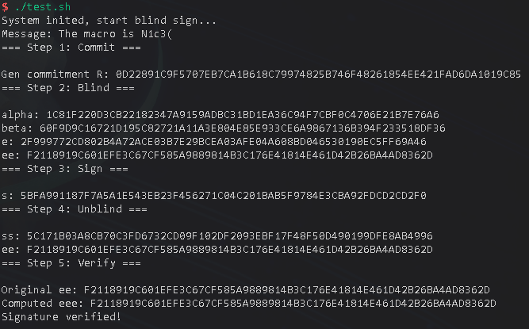

#### 具体实现

1. $Setup$: 选择素数 $p, q$ 使得 $q \mid (p-1)$，取阶为 $q$ 的生成元 $g$；设哈希 $H:\{0,1\}^* \to \mathbb{Z}_q$。私钥 $x \in \mathbb{Z}_q$，公钥 $y = g^x \; mod \; p$。
2. $Commit$: 签名者选随机数 $k \leftarrow \mathbb{Z}_q$，计算 $R = g^{k} \; mod \; p$，发送 $R$ 给用户。
3. $Blind(m, R)$: 用户选盲化因子 $\alpha,\beta \leftarrow \mathbb{Z}_q$，计算 $R' = R \cdot g^{\alpha} \cdot y^{\beta} \; mod \; p$，令 $e' = H(R' \,\|\, m)$，并令 $e = e' + \beta \; mod \; q$，把 $e$ 发给签名者。
4. $Sign(x, e)$: 签名者计算 $s = k + x \cdot e \; mod \; q$，返回 $s$。
5. $Unblind(s, \alpha)$: 用户计算 $s' = s + \alpha \; mod \; q$，得到最终签名 $\sigma = (e', s')$。
6. $Verify(y, m, \sigma)$: 验证者计算 $R'' = g^{s'} \cdot y^{-e'} \; mod \; p$，检查 $H(R'' \,\|\, m) \;?=\; e'$。

再有就是联想起`mpz`库中的`mpz_clears`宏，故而也编写了几个宏来简化代码

```cpp
// BIGNUM* x = BN_new();
#define NNN(x) BIGNUM* x = BN_new();
// BN_free(v1); BN_free(v2); ...
#define BF(...) \
    do { \
        BIGNUM* bn_list[] = { __VA_ARGS__ }; \
        for (BIGNUM* bn : bn_list) { \
            BN_free(bn); \
        } \
    } while (0) 
```