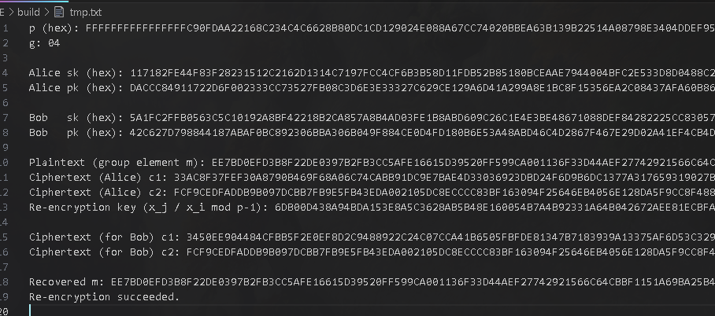
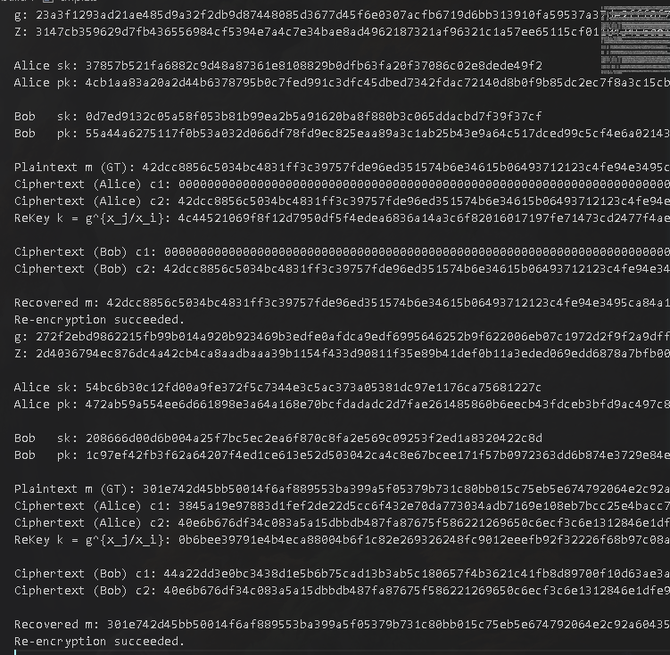
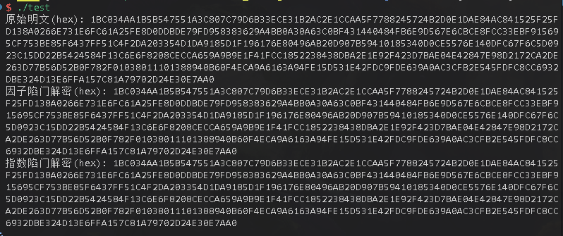

# 高级密码第06次实验报告

## 系统环境

```sh
 Virtualization: wsl
 Operating System: Ubuntu 24.04.2 LTS                      
Kernel: Linux 5.15.153.1-microsoft-standard-WSL2
 Architecture: x86-64
```

## 代理重加密

### 项目编译

```bash
mkdir -p ./build &&
cd ./build &&
cmake .. &&
make 
```

### 基于ElGamal的双向代理重加密

#### 运行结果



### 基于配对的单向代理重加密

#### 运行结果



### 具体实现

也是只用跟着注释就好，用的还是之前SSL/Crypto还有PCB库中的常用操作，就是有时候容易忘记初始化值，例如开始时 m 没有randomize(), 导致最后虽然也能通过 assert 但是实际上是错的。

## 多密钥的BCP加密方案

### 程序编译

```bash
g++ ./bcp.cpp ./utils.cpp -o ./bcp -lssl -lcrypto
```

### 运行结果



### 具体实现

+ `set-up`

```cpp
std::pair<BCPParams, BCPMasterKey> BCP::setup(size_t bit_length) {
    // 待学生实现：生成 (params, master)
    // 实现提示（按步骤完成）：
    // 1) 校验 bit_length >= 2048，太小直接抛出异常。
    if (bit_length < 2048) {
        throw std::invalid_argument("bit_length at minimium 2048");
    }
    // 2) prime_bits = bit_length/2，调用 BNUtils::generate_prime 生成 safe prime p、q。
    auto ctx = BNUtils::cmake();
    auto prime_bits = bit_length / 2;
    auto p = BNUtils::make();
    auto q = BNUtils::make();
    BNUtils::generate_prime(p, prime_bits);
    BNUtils::generate_prime(q, prime_bits);
    // 3) 计算 n=p*q，n_square=n^2。
    auto n = BNUtils::mul(p, q);
    auto n_square = BNUtils::mul(n, n);
    // 4) 计算 λ=lcm(p-1,q-1)：可先算 p-1、q-1，再用 gcd 与 乘法求 lcm。
    auto p_1 = BNUtils::dup(p);
    auto q_1 = BNUtils::dup(q);
    BNUtils::sub_word(p_1, 1);
    BNUtils::sub_word(q_1, 1);
    // - lcm(p-1, q-1) = gcd(p-1, q-1)^{-1} * (p-1)*(q-1)
    auto gcd = BNUtils::gcd(p_1, q_1, ctx);
    auto p_1_q_1 = BNUtils::mul(p_1, q_1, ctx);
    auto gcd_inv = BNUtils::mod_inv(gcd, n, ctx);
    auto lambda = BNUtils::mod_mul(gcd_inv, p_1_q_1, n, ctx);
    // 5) 随机采样 g∈Z*_{n^2} 满足：
fallback:
    bool done = false;
    auto mu = BNUtils::make();
    auto g = BNUtils::make();
    do {
        g = BNUtils::random_range(n_square);
        //    - gcd(g, n^2)=1 且 g (mod n) ≠ 1；
        if (BNUtils::cmp(BNUtils::gcd(g, n_square), BNUtils::from_uint(1)) != 0) {
            continue;
        }
        if (BNUtils::cmp(BNUtils::mod(g, n, ctx), BNUtils::from_uint(1)) == 0) {
            continue;
        }
        //    - n | (g^λ-1)（保证可做 L(x)）；L(g^λ) mod n 与 n 互素；
        auto g_lambda = BNUtils::mod_exp(g, lambda, n_square, ctx);
        auto g_lambda_minus_1 = BNUtils::mod_sub(g_lambda, BNUtils::from_uint(1), n_square, ctx);
        if (BNUtils::is_zero(BNUtils::mod(g_lambda_minus_1, n, ctx)) == false) {
            continue;
        }
        //    - mu = L(g^λ)^{-1} mod n。
        mu = BNUtils::mod_inv(BNUtils::div(g_lambda_minus_1, n, ctx), n, ctx); // （g^λ - 1 / n）{-1} mod n
        done = true;
    } while (!done);
    // 6) 返回 {BCPParams(n,n_square,g), BCPMasterKey(p,q,λ,μ)}。
    return std::make_pair(BCPParams(std::move(n), std::move(n_square), std::move(g)),
        BCPMasterKey(std::move(p), std::move(q), std::move(lambda), std::move(mu)));
    throw std::logic_error("TODO: 请实现 setup");
}
```

+ 使用a解密

```cpp
Big BCP::decrypt_with_exponent(const BCPParams& params, const Big& priv_exp, const BCPCiphertext& ct) {
    // 待学生实现：用私钥指数 a 解密
    // 实现提示：
    // 1) 定义 L(x)=(x-1)/n 并校验能被 n 整除。
    auto ctx = BNUtils::cmake();
    auto L = [&](const Big& x) -> Big {
        auto x_minus_1 = BNUtils::mod_sub(x, BNUtils::from_uint(1), params.n_square, ctx);
        if (BNUtils::is_zero(BNUtils::mod(x_minus_1, params.n, ctx)) == false) {
            throw std::invalid_argument("L(x) undefined for given x");
        }
        return BNUtils::div(x_minus_1, params.n, ctx);
    };
    // 2) 计算 A^a mod n^2，再求逆 inv = (A^a)^{-1} mod n^2。
    auto A_a = BNUtils::mod_exp(ct.A, priv_exp, params.n_square, ctx);
    auto inv = BNUtils::mod_inv(A_a, params.n_square, ctx);
    // 3) masked = B * inv mod n^2 = 1 + m·n。
    auto masked = BNUtils::mod_mul(ct.B, inv, params.n_square, ctx);
    // 4) 返回 L(masked) 得到 m。
    auto m = L(masked);
    return m;
    throw std::logic_error("TODO: 请实现 decrypt_with_exponent");
}
```

+ 然后剩下的其实就和 Paillier 差不多