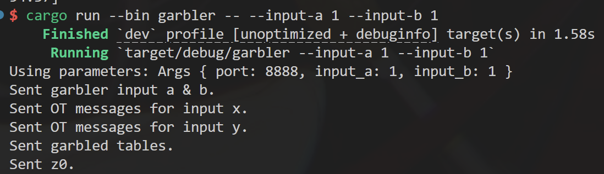
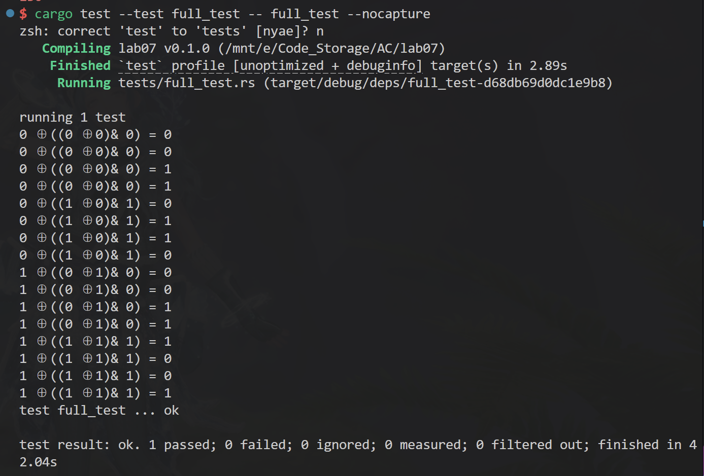
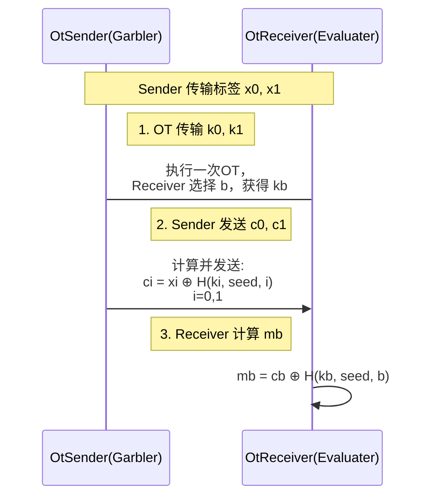
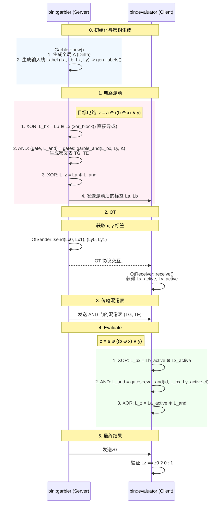

# 高级密码第07次实验报告

> [!important]
> 本项目使用了AI进行辅助

## 系统环境

```bash
Virtualization: wsl
Operating System: Ubuntu 24.04.2 LTS                      
Kernel: Linux 5.15.153.1-microsoft-standard-WSL2
Architecture: x86-64
rustc 1.91.0 (f8297e351 2025-10-28)
cargo 1.91.0 (ea2d97820 2025-10-10)
rustup 1.28.2 (e4f3ad6f8 2025-04-28)
```

## 项目结构

```
lab07
├── Cargo.toml
├── src
│   ├── bin
│   │   ├── evaluater.rs # Cient, 运算方
│   │   └── garbler.rs # Server, 混淆生成方
│   ├── circuit # 混淆电路与运算相关
│   │   ├── gates.rs
│   │   ├── mod.rs
│   │   └── utils.rs
│   ├── lib.rs
│   ├── network.rs # 网络通信
│   └── simplest_ot # SimlestOT 实现
│       ├── mod.rs
│       ├── ot_receiver.rs
│       ├── ot_sender.rs
│       └── utils.rs # 相关数学运算
└── tests
```

## 项目编译

```bash
cargo install --path . --root . 
```

最后生成的可执行文件在 `./bin` 下

```bash
$ ls ./bin           
evaluater  garbler
```

## 项目运行

1. garbler (server)

+ 运行参数

```bash
$ ./bin/garbler -h   
Usage: garbler [OPTIONS]

Options:
  -p, --port <PORT>        [default: 8888]
      --input-a <INPUT_A>  [default: 0]
      --input-b <INPUT_B>  [default: 0]
  -h, --help               Print help
```

+ 运行示例


2. evaluater (client)

+ 运行参数

```bash
Usage: evaluater [OPTIONS]

Options:
      --host <HOST>        [default: 0.0.0.0]
  -p, --port <PORT>        [default: 8888]
      --input-x <INPUT_X>  [default: 0]
      --input-y <INPUT_Y>  [default: 0]
  -h, --help               Print help
```

+ 运行示例


3. 覆盖测试



## 基础功能

+ 使用`RustCrypro`中的`k256(secp256k1)`曲线实现*OT*中的基础数学运算，使用`sha2`实现哈希函数。

+ 网络通信方面，使用`tokio`库进行*Tcp*网络传输，并且结合运用`serde_json`直接使用*json*传输数据避免定义过多传输结构。

+ 使用 `clap` 库实现命令行参数解析。

## OT 实现

**`src/simplest_ot`**

> [!note]
> 这里的 *SimplesOT* 参考自 [`libOTe`](https://github.com/osu-crypto/libOTe/tree/master/libOTe/Base)

### 方案描述

#### Sender 初始化

1.  $a \xleftarrow{\$} \mathbb{Z}_q$
2.  $A = a \cdot G$
3.  $\texttt{seed} \xleftarrow{\$} \{0,1\}^\lambda$， 
计算承诺 $\texttt{comm} = H(\texttt{seed})$
4. $(A, \texttt{comm} \rightarrow \text{Receiver})$

#### Receiver 响应

1. $\text{Receiver} \leftarrow A$。
2. $r \xleftarrow{\$} \mathbb{Z}_q$。
3. 计算两个候选公钥：
$$
B_0 = r \cdot G,\quad B_1 = A + B_0
$$
4. 根据选择位 $b$，令 $B = B_b$
5. $B \rightarrow \text{Sender}$

#### Sender 派生密钥与消息

1. $\text{Sender} \leftarrow B$。
2. 计算共享密钥：
$$
K_0 = a \cdot B \\ 
K_1 = K_0 - a \cdot A
$$

> 若 $b = 0$，则 $B = rG \quad \Rightarrow \quad K_0 = arG$，$K_1 = arG - a^2G$

> 若 $b = 1$，则 $B = A + rG = (a + r)G \quad \Rightarrow \quad K_0 = a(a + r)G$，$K_1 = a(a + r)G - a^2G = arG$

3. $seed \rightarrow Receiver$ , Receiver 验证 $H(\texttt{seed}) = \texttt{comm}$。
4. 生成最终消息：
$$
m_0 = H(K_0, \texttt{seed}, 0),\quad m_1 = H(K_1, \texttt{seed}, 1)
$$
6. $(m_0, m_1) \rightarrow \text{Receiver}$

#### Receiver 派生消息

1. 计算 $K = r \cdot A = r \cdot (a \cdot G) = (ar) \cdot G$

> 若 $b = 0$，则 $K = K_0$（Sender 的 $m_0$ 对应密钥）

> 若 $b = 1$，则 $K = K_1$（Sender 的 $m_1$ 对应密钥）

2. 派生消息：
$$
m_b = H(K, \texttt{seed}, b)
$$

#### 安全性分析

+ Receiver 隐私性：Sender 无法区分 $B_0$ 与 $B_1$，椭圆曲线上的 *DDH*

+ Sender 安全性：Receiver 仅能计算 $K_b = arG$，无法同时获得 $K_0$ 和 $K_1$

### SimplestOT传输标签



## 混淆电路实现（硬编码形式）

### 基础数据结构

+ `src::circuit::utils::Block`: 定义一个长度为 16 的 u8 数组，总过128比特，作为参与运算的标签

+ `src::circuit::gates::Cipher`: 存储 and 门的密文表 $\{ tg, te \}$

### 交互流程



### 部分代码

```rust
// src::circuit::gates

impl Gabler {
    // 标签生成
    pub fn gen_labels(&self) -> (Block, Block) {
        let label0 = rand_block();
        let label1 = xor_block(&label0, &self.delta);
        (label0, label1)
    }
    
    // and 混淆
    pub fn garble_and(
        &self,
        a0: &Block,
        a1: &Block,
        b0: &Block,
        b1: &Block,
        gid: u64,
    ) -> (Block, Block, Cipher) {
        let pa = get_lsb(a0);
        let pb = get_lsb(b0);

        let ha0 = hash_label(a0, gid, 0);
        let ha1 = hash_label(a1, gid, 0);
        let hb0 = hash_label(b0, gid, 1);
        let hb1 = hash_label(b1, gid, 1);

        let mut tg = xor_block(&ha0, &ha1);
        if pb {
            tg = xor_block(&tg, &self.delta);
        }

        let mut te = xor_block(&hb0, &hb1);
        te = xor_block(&te, a0);

        let mut wg0 = ha0;
        if pa {
            wg0 = xor_block(&wg0, &tg);
        }

        let mut wg0 = xor_block(&wg0, &hb0);
        if pb {
            let tmp = xor_block(&te, a0);
            wg0 = xor_block(&wg0, &tmp);
        }

        let wg1 = xor_block(&wg0, &self.delta);

        (wg0, wg1, Cipher { tg, te })
    }
}

/// Evaluate AND gate
pub fn eval_and_gate(
    label_a: &Block,
    label_b: &Block,
    garbled_table: &(Block, Block),
    gid: u64,
) -> Block {
    let (tg, te) = garbled_table;
    let sa = get_lsb(label_a);
    let sb = get_lsb(label_b);

    // wga = H(a) ^ ( sa ? tg : 0 )
    let ha = hash_label(label_a, gid, 0);
    let mut wga = ha;
    if sa {
        wga = xor_block(&wga, tg);
    }

    // web = H(b) ^ ( sb ? te ^ a : 0 )
    let hb = hash_label(label_b, gid, 1);
    let mut web = hb;
    if sb {
        let tmp = xor_block(te, label_a);
        web = xor_block(&web, &tmp);
    }

    xor_block(&wga, &web)
}
```

